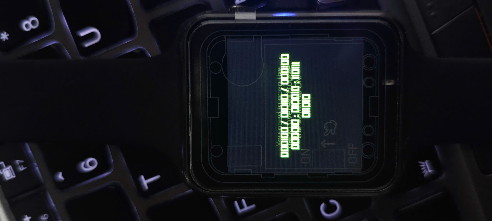
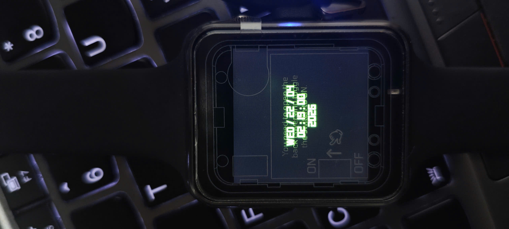
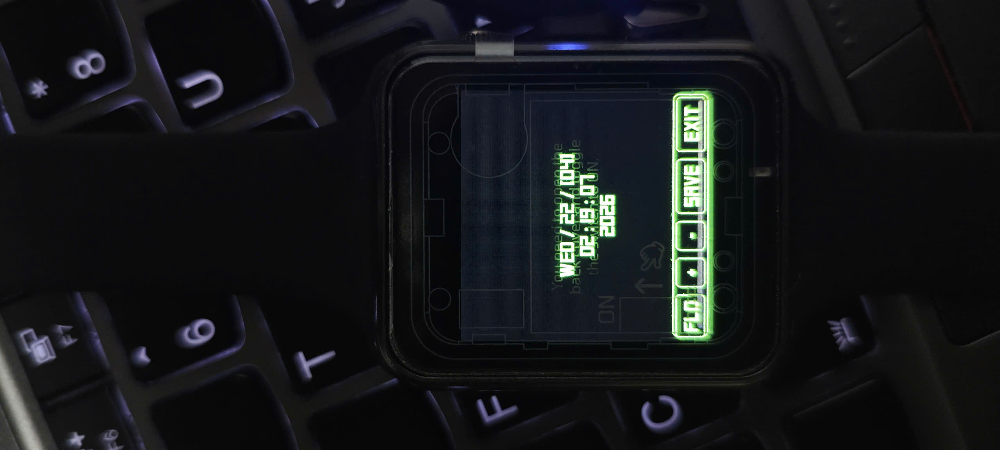

# ⌚ T-Watch S3 Binary Clock (LVGL + Gesture Control)

Hiển thị thời gian trên **LilyGo T-Watch S3 (ESP32-S3)** với giao diện tối giản và điều khiển hoàn toàn bằng cảm ứng (gesture).

---

## 📷 Preview

### 🧮 Chế độ nhị phân (Binary mode)


### 🔢 Chế độ thập phân (Digital mode)


### ⚙️ Chế độ chỉnh cài đặt (Setting mode)


---

## ⚙️ Tính năng

- 2 chế độ hiển thị:
  - Binary clock (bit)
  - Digital clock (ngày + giờ)
- Gesture điều khiển:
  - Vuốt lên → tăng giá trị
  - Vuốt xuống → giảm giá trị
  - Double tap → chuyển field (day → month → year → ...)
  - Giữ 5 giây → vào / thoát chế độ chỉnh giờ
- Tự động:
  - Tắt màn hình khi không hoạt động
  - Bật màn hình khi:
    - Nghiêng cổ tay (BMA423)
    - Double tap

---

## 🧠 Logic điều khiển

| Hành động        | Chức năng |
|-----------------|----------|
| Giữ 5 giây       | Vào/thoát setting mode |
| Vuốt lên         | Tăng giá trị |
| Vuốt xuống       | Giảm giá trị |
| Double tap       | Đổi field |
| Không thao tác   | Tắt màn hình |

---

## 🔧 Build (PlatformIO)

```bash
python -m esptool --chip esp32s3 --baud 460800 write-flash 0x0 merged.bin
or
pio run -e twatchs3 -t upload